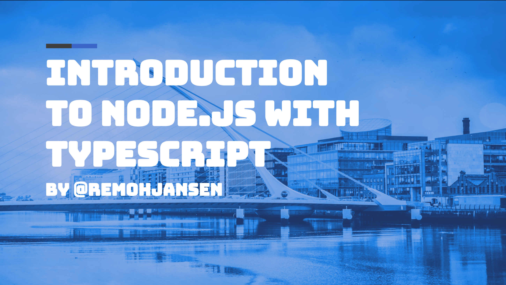

# Node.js + TypeScript + TypeORM demo

You can run the example using `npm install` and `ts-node ./src/backend/index.ts`

Alternatively, you can use `npm start` which is an alias for `ts-node ./src/backend/index.ts`.

There is also a command `npm test` that will run some automated tests. This was not demostrated during the talk but it is included for those that would like to learn more.

